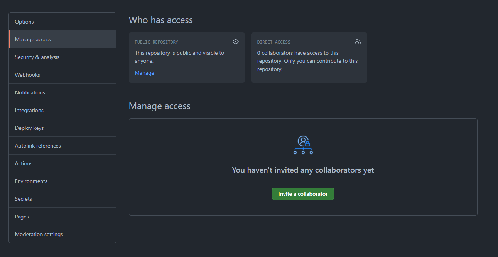

#Rock Paper Scissors
The goal of this project is to develop your understanding of how to use Maven and 
Github by building a basic java application. 

##Instructions
Please read through the following instructions at least once before you begin working 
on the project so that you will have a good understanding of what it is you are building.

###High Level Goal

Design and implement an application in Java that plays the Rock-Paper-Scissors game against 
the computer. The program should prompt the user to choose a game mode. Single player or Two player mode. 

In Single Player Mode, the user picks on of picks one of three options (usually shown by a hand gesture) at the same time, 
and a winner is determined. In the game, Rock beats Scissors, Scissors beats Paper, and Paper beats Rock. The program will 
use number to represent each gesture, 1 = rock, 2 = scissors, and 3 = paper. The bot (second player) should randomly
choose one of the three options (without revealing it).

In Two Player Mode is similar only that the second player has the option two choose after the first player has chosen.

At that point, the program reveals both choices and prints a statement indicating whether the user won, 
the computer(second player) won, or it was a tie. Continue playing until the user chooses to stop by saying either ‘Y’ or ‘N’, 
where ‘Y’ means ‘yes continue playing’, and ‘N’ means ‘no stop playing’. Then print the number of user wins, losses, 
and ties.

###Github

You must fork this project, then you will need to clone this project to your desktop to where you should open the 
project using IntelijIDEA. To do this, click on File -> New -> Open Project From Existing Source. This is used to make sure
Maven loads with your project.
Be sure in the settings of you Github Repository to go to Manage Access and give me access.

###POM.xml
We must first start off by importing certain plugins for this project. We will be using the JUnit plugin to be able to test if our code functions as intended.

To begin, open your pom.xml file, you could import the code manually from the Junit website however we will use a shortcut. Use alt + Insert and chose dependencies, 
You will then use the Maven Artifact Search to look for "junit". We will be using version 4.12. You will then see that the dependency is automatically
added into your Project Object Model.

Also add Mockito version 3.11 in your dependencies

###prerequisite
Know how to use the scanner class and random class.

###main method
The main method is similar to the main method in C++. All function calls will be handled here. 
This would call generateTitle and starts the game

###generateTitle

This method is void thus it does not return anything. 
It only displays a title when the method is called.

##startGame
Asks the user to choose a game mode, enter 1 to start a single player game or 2 to start
a two player game. The code must be able to ask the question again when given a wrong value.
hint: use recursion.

###singlePlayerGame
Prompts the user for their input. The bot is given a randomly generate number 
from 1 to 3. Use the gameLogic method to insert the users and bot value to get an outcome. 

###twoPlayerGame
Prompts both players for their input. The gameLogic method is used to dictate the outcome.

###gameLogic 
This methods takes two arguments, the player 1 input and the player 2 input (bot). 
The code must state who won. It must also add a point to either ties, player1Wins or player2Win.

###checkEndGame
This method is used after a game is complete, it will prompt the user to play again. 
It takes in a parameter of gameType which is an int. 1 = single player game and 2 = two player game. This is to be able
to re-use the code for multiple different game modes. If the user input Y and gametype = 1 then it will start a single player game.  
Choosing N should display all scores.